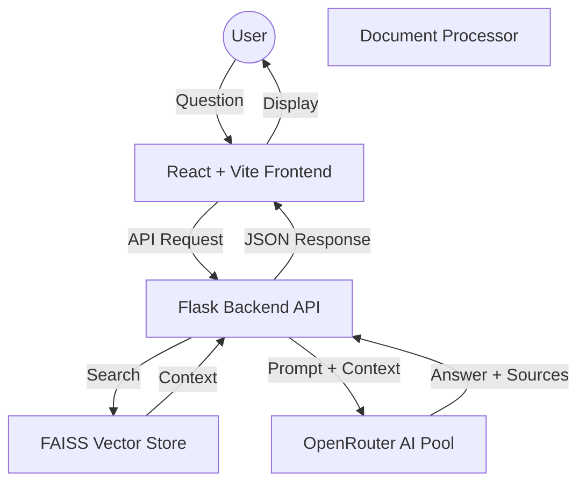

# 📘 RAG Assistant: Advanced Document Q&A System

A premium RAG (Retrieval-Augmented Generation) application built for high-performance document analysis. This project features a modern React frontend and a robust Flask backend with intelligent model rotation for high availability.

## 🚀 Key Features

- **Advanced RAG Pipeline**: Uses FAISS for lightning-fast vector search and document retrieval.
- **Model Fallback System**: Automatically cycles through **9+ free LLM models** (Mistral, Llama, Gemini, Qwen, etc.) via OpenRouter to ensure 100% uptime and bypass rate limits.
- **Premium UX/UI**: Responsive Glassmorphism design with `framer-motion` animations and **Dark Mode** support.
- **Source Transparency**: Every AI answer includes specific **Citations** from the source document to ensure factual accuracy.
- **Persistence**: Remembers your chat history and theme preferences across sessions using `localStorage`.

## 🏗️ Architecture



## 🛠️ Tech Stack

- **Frontend**: React 19, Vite, Framer Motion, Lucide Icons, Axios, Vanilla CSS.
- **Backend**: Flask, Python 3.11, OpenRouter API.
- **AI/Vector DB**: FAISS (Facebook AI Similarity Search), SentenceTransformers.
- **Deployment**: Production-ready with Waitress (WSGI).

## 📥 Local Setup

1. **Clone & Install Backend**:
   ```bash
   pip install -r backend/requirements.txt
   ```
2. **Add API Key**: Create a `backend/.env` file and add:
   ```env
   OPENROUTER_API_KEY=your_key_here
   ```
3. **Install Frontend**:
   ```bash
   cd frontend
   npm install
   ```
4. **Run both**:
   - Backend: `python backend/app.py`
   - Frontend: `npm run dev`

---

## 📈 Future Roadmap
- [ ] **Multi-User Authentication** via Supabase.
- [ ] **Advanced Semantic Search** with Hybrid BM25.
- [ ] **Inline PDF Viewer** with text highlighting.

---

> [!NOTE]
> This project was developed as a technical portfolio piece to demonstrate Fullstack AI integration and resilient system design.
